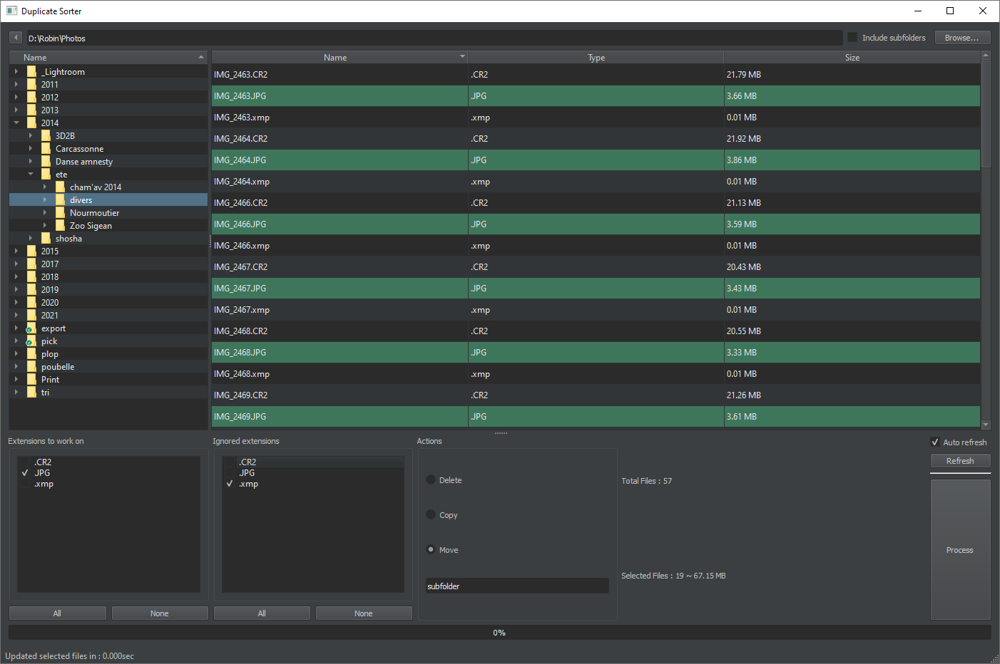

# Duplicate Sorter

Duplicate sorter is a sorting tool to remove files that have the same name as other files but with a different extension.
Created to remove the side .jpgs that have an existing .raw version with the same name but ignore the fact that some also have an .xmp file.

